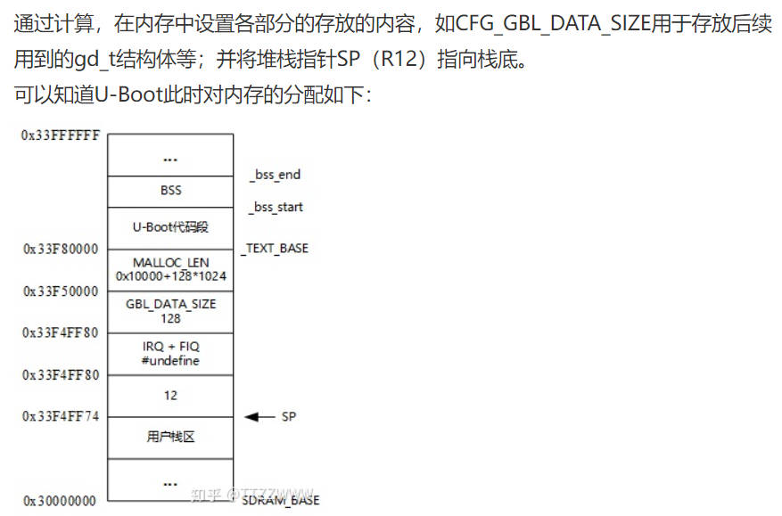

# uboot源码分析第1阶段

[uboot启动过程完全分析](https://www.cnblogs.com/ljf181275034/archive/2011/12/09/2281786.html)

[U-Boot-1.1.6移植到MINI2440开发板（3） —— 源码分析第一阶段](http://news.eeworld.com.cn/mcu/ic626769_5.html)

## 第1节 以前的单片机程序

在讲解uboot源码之前，我们先来回顾一下，以前我们写的硬件部件的实验跟uboot是差不多的。主要有以下的流程：

1. 初始化
    + 观看门狗
    + 初始化时钟
    + 初始化SDRAM
2. 把程序从NAND Flash拷贝到SDRAM
3. 设置SP栈（调用C函数）

所谓的uboot就是个复杂的单片机程序，这些流程当然也得做。uboot做了些什么？

## 第2节 uboot程序

uboot跟裸机程序类似，主要有以下的流程：

1. 硬件相关初始化
2. 设置栈（SP指向内存）
3. 调用C函数，从Flash读出内核，启动内核

## 第3节 启动文件start.S

uboot链接脚本中，第1个执行的程序就是启动文件cpu/arm920t/start.S

### 1 中断向量表，有相对跳转和绝对跳转两种区别。
`b reset`是相对跳转，因为此时SDRAM还没有初始化，代码也还没有进行重定位，只能在Nor或SRAM中运行，即只能在加载地址中运行。

`ldr pc, _pos`是绝对跳转，用来处理各种中断和异常。我们认为此时已经完成了硬件初始化和代码重定位，当发生异常时CPU会从SDRAM跳转到Nor上，然后`ldr pc`又跳回SDRAM去执行。

```s
.globl _start
_start:	b       reset
	ldr	pc, _undefined_instruction
	ldr	pc, _software_interrupt
	ldr	pc, _prefetch_abort
	ldr	pc, _data_abort
	ldr	pc, _not_used
	ldr	pc, _irq
	ldr	pc, _fiq
```

### 2 reset函数

1. CPU设为SVC管理模式

```s
reset:
	/*
	 * set the cpu to SVC32 mode
	 */
	mrs	r0,cpsr
	bic	r0,r0,#0x1f
	orr	r0,r0,#0xd3
	msr	cpsr,r0
```

2. 关闭看门狗

```s
	ldr     r0, =pWTCON
	mov     r1, #0x0
	str     r1, [r0]
```

3. 关闭所有中断

```s
	mov	r1, #0xffffffff
	ldr	r0, =INTMSK
	str	r1, [r0]
# if defined(CONFIG_S3C2410)
	ldr	r1, =0x3ff
	ldr	r0, =INTSUBMSK
	str	r1, [r0]
# endif
```

4. CPU初始化

如果我们一开始是从Nor上运行的，那么_start的地址就是0，r0寄存器值为0。肯定跟r1寄存器不相等，那么就去执行`cpu_init_crit`函数。

而如果我们的代码是通过仿真器直接下载进去的，那么r0就跟r1相等，不需要在执行cpu初始化。

```s
#ifndef CONFIG_SKIP_LOWLEVEL_INIT
	adr	r0, _start		/* r0 <- current position of code   */
	ldr	r1, _TEXT_BASE		/* test if we run from flash or RAM */
	cmp     r0, r1                  /* don't reloc during debug         */
	blne	cpu_init_crit
#endif
```

cpu_init_crit函数，执行的就是关cache，关mmu，调用lowlevel_init函数，真正去初始化

```s
cpu_init_crit:
	/*
	 * flush v4 I/D caches
	 */
	mov	r0, #0
	mcr	p15, 0, r0, c7, c7, 0	/* flush v3/v4 cache */
	mcr	p15, 0, r0, c8, c7, 0	/* flush v4 TLB */

	/*
	 * disable MMU stuff and caches
	 */
	mrc	p15, 0, r0, c1, c0, 0
	bic	r0, r0, #0x00002300	@ clear bits 13, 9:8 (--V- --RS)
	bic	r0, r0, #0x00000087	@ clear bits 7, 2:0 (B--- -CAM)
	orr	r0, r0, #0x00000002	@ set bit 2 (A) Align
	orr	r0, r0, #0x00001000	@ set bit 12 (I) I-Cache
	mcr	p15, 0, r0, c1, c0, 0

	/*
	 * before relocating, we have to setup RAM timing
	 * because memory timing is board-dependend, you will
	 * find a lowlevel_init.S in your board directory.
	 */
	mov	ip, lr
	bl	lowlevel_init
	mov	lr, ip
	mov	pc, lr
```

lowlevel_init函数，初始化SDRAM

```s
lowlevel_init:
	/* memory control configuration */
	/* make r0 relative the current location so that it */
	/* reads SMRDATA out of FLASH rather than memory ! */
	ldr     r0, =SMRDATA
	ldr	r1, _TEXT_BASE
	sub	r0, r0, r1
	ldr	r1, =BWSCON	/* Bus Width Status Controller */
	add     r2, r0, #13*4
0:
	ldr     r3, [r0], #4
	str     r3, [r1], #4
	cmp     r2, r0
	bne     0b

	/* everything is fine now */
	mov	pc, lr

	.ltorg
/* the literal pools origin */

SMRDATA:
    .word (0+(B1_BWSCON<<4)+(B2_BWSCON<<8)+(B3_BWSCON<<12)+(B4_BWSCON<<16)+(B5_BWSCON<<20)+(B6_BWSCON<<24)+(B7_BWSCON<<28)) 
    .word ((B0_Tacs<<13)+(B0_Tcos<<11)+(B0_Tacc<<8)+(B0_Tcoh<<6)+(B0_Tah<<4)+(B0_Tacp<<2)+(B0_PMC))
    .word ((B1_Tacs<<13)+(B1_Tcos<<11)+(B1_Tacc<<8)+(B1_Tcoh<<6)+(B1_Tah<<4)+(B1_Tacp<<2)+(B1_PMC))
    .word ((B2_Tacs<<13)+(B2_Tcos<<11)+(B2_Tacc<<8)+(B2_Tcoh<<6)+(B2_Tah<<4)+(B2_Tacp<<2)+(B2_PMC))
    .word ((B3_Tacs<<13)+(B3_Tcos<<11)+(B3_Tacc<<8)+(B3_Tcoh<<6)+(B3_Tah<<4)+(B3_Tacp<<2)+(B3_PMC))
    .word ((B4_Tacs<<13)+(B4_Tcos<<11)+(B4_Tacc<<8)+(B4_Tcoh<<6)+(B4_Tah<<4)+(B4_Tacp<<2)+(B4_PMC))
    .word ((B5_Tacs<<13)+(B5_Tcos<<11)+(B5_Tacc<<8)+(B5_Tcoh<<6)+(B5_Tah<<4)+(B5_Tacp<<2)+(B5_PMC))
    .word ((B6_MT<<15)+(B6_Trcd<<2)+(B6_SCAN))
    .word ((B7_MT<<15)+(B7_Trcd<<2)+(B7_SCAN))
    .word ((REFEN<<23)+(TREFMD<<22)+(Trp<<20)+(Trc<<18)+(Tchr<<16)+REFCNT)
    .word 0xb1
    .word 0x30
    .word 0x30
```

5. 设置栈

在此时才设置的栈，所以前面的函数`lowlevel_init`不能用C代码来实现。

```s
	/* Set up the stack						    */
stack_setup:
	ldr	r0, _TEXT_BASE		/* upper 128 KiB: relocated uboot   */
	sub	r0, r0, #CFG_MALLOC_LEN	/* malloc area                      */
	sub	r0, r0, #CFG_GBL_DATA_SIZE /* bdinfo                        */

#ifdef CONFIG_USE_IRQ
	sub	r0, r0, #(CONFIG_STACKSIZE_IRQ+CONFIG_STACKSIZE_FIQ)
#endif
	sub	sp, r0, #12		/* leave 3 words for abort-stack    */
```

下面是整个uboot的内存分配：



到这里栈已经设置好了，只有栈设置好了才能去调用C函数。

6. 初始化时钟

```s
bl clock_init
```

7. 重定位

重定位，就是代码从Flash拷贝到SDRAM内存中。

调用了`CopyCode2Ram`函数，复制整个uboot代码，然后循环清除bss段。

```s
// 启动程序的加载地址
_armboot_start: .word _start
// 链接脚本的bss段的链接地址
_bss_start: .word __bss_start

relocate:				/* relocate U-Boot to RAM	    */
	adr	r0, _start		/* r0 <- current position of code   */
	ldr	r1, _TEXT_BASE		/* test if we run from flash or RAM */

	ldr	r2, _armboot_start
	ldr	r3, _bss_start
	sub	r2, r3, r2		/* r2 <- size of armboot            */

	bl  CopyCode2Ram	/* r0: source, r1: dest, r2: size */

clear_bss:
	ldr	r0, _bss_start		/* find start of bss segment        */
	ldr	r1, _bss_end		/* stop here                        */
	mov 	r2, #0x00000000		/* clear                            */

clbss_l:str	r2, [r0]		/* clear loop...                    */
	add	r0, r0, #4
	cmp	r0, r1
	ble	clbss_l
```

8. 调用C函数`start_armboot`，挑战到uboot执行

这里使用了绝对跳转，跳到函数start_armboot去执行。由于前面执行了重定位，此处是从Nor跳转到SDRAM中的副本去执行了。

```s
_start_armboot:	.word start_armboot

	ldr	pc, _start_armboot
```

start_armboot函数是什么？

`lib_arm/board.c`中的start_armboot函数内容：

```c
void start_armboot (void)
{
	init_fnc_t **init_fnc_ptr;
	char *s;
#ifndef CFG_NO_FLASH
	ulong size;
#endif
#if defined(CONFIG_VFD) || defined(CONFIG_LCD)
	unsigned long addr;
#endif

	/* Pointer is writable since we allocated a register for it */
	gd = (gd_t*)(_armboot_start - CFG_MALLOC_LEN - sizeof(gd_t));
	/* compiler optimization barrier needed for GCC >= 3.4 */
	__asm__ __volatile__("": : :"memory");

	memset ((void*)gd, 0, sizeof (gd_t));
	gd->bd = (bd_t*)((char*)gd - sizeof(bd_t));
	memset (gd->bd, 0, sizeof (bd_t));

	monitor_flash_len = _bss_start - _armboot_start;

	for (init_fnc_ptr = init_sequence; *init_fnc_ptr; ++init_fnc_ptr) {
		if ((*init_fnc_ptr)() != 0) {
			hang ();
		}
	}

#ifndef CFG_NO_FLASH
	/* configure available FLASH banks */
	size = flash_init ();
	display_flash_config (size);
#endif /* CFG_NO_FLASH */

#ifdef CONFIG_VFD
#	ifndef PAGE_SIZE
#	  define PAGE_SIZE 4096
#	endif
	/*
	 * reserve memory for VFD display (always full pages)
	 */
	/* bss_end is defined in the board-specific linker script */
	addr = (_bss_end + (PAGE_SIZE - 1)) & ~(PAGE_SIZE - 1);
	size = vfd_setmem (addr);
	gd->fb_base = addr;
#endif /* CONFIG_VFD */

#ifdef CONFIG_LCD
#	ifndef PAGE_SIZE
#	  define PAGE_SIZE 4096
#	endif
	/*
	 * reserve memory for LCD display (always full pages)
	 */
	/* bss_end is defined in the board-specific linker script */
	addr = (_bss_end + (PAGE_SIZE - 1)) & ~(PAGE_SIZE - 1);
	size = lcd_setmem (addr);
	gd->fb_base = addr;
#endif /* CONFIG_LCD */

	/* armboot_start is defined in the board-specific linker script */
	mem_malloc_init (_armboot_start - CFG_MALLOC_LEN);

#if (CONFIG_COMMANDS & CFG_CMD_NAND)
	puts ("NAND:  ");
	nand_init();		/* go init the NAND */
#endif

#ifdef CONFIG_HAS_DATAFLASH
	AT91F_DataflashInit();
	dataflash_print_info();
#endif

	/* initialize environment */
	env_relocate ();

#ifdef CONFIG_VFD
	/* must do this after the framebuffer is allocated */
	drv_vfd_init();
#endif /* CONFIG_VFD */

	/* IP Address */
	gd->bd->bi_ip_addr = getenv_IPaddr ("ipaddr");

	/* MAC Address */
	{
		int i;
		ulong reg;
		char *s, *e;
		char tmp[64];

		i = getenv_r ("ethaddr", tmp, sizeof (tmp));
		s = (i > 0) ? tmp : NULL;

		for (reg = 0; reg < 6; ++reg) {
			gd->bd->bi_enetaddr[reg] = s ? simple_strtoul (s, &e, 16) : 0;
			if (s)
				s = (*e) ? e + 1 : e;
		}

#ifdef CONFIG_HAS_ETH1
		i = getenv_r ("eth1addr", tmp, sizeof (tmp));
		s = (i > 0) ? tmp : NULL;

		for (reg = 0; reg < 6; ++reg) {
			gd->bd->bi_enet1addr[reg] = s ? simple_strtoul (s, &e, 16) : 0;
			if (s)
				s = (*e) ? e + 1 : e;
		}
#endif
	}

	devices_init ();	/* get the devices list going. */

#ifdef CONFIG_CMC_PU2
	load_sernum_ethaddr ();
#endif /* CONFIG_CMC_PU2 */

	jumptable_init ();

	console_init_r ();	/* fully init console as a device */

#if defined(CONFIG_MISC_INIT_R)
	/* miscellaneous platform dependent initialisations */
	misc_init_r ();
#endif

	Port_Init();
	if (!PreLoadedONRAM) {
		/* enable exceptions */
		enable_interrupts ();
	    /* add by www.100ask.net */
	    usb_init();
	}

    /* Perform network card initialisation if necessary */
#ifdef CONFIG_DRIVER_CS8900
	cs8900_get_enetaddr (gd->bd->bi_enetaddr);
#endif

#if defined(CONFIG_DRIVER_SMC91111) || defined (CONFIG_DRIVER_LAN91C96)
	if (getenv ("ethaddr")) {
		smc_set_mac_addr(gd->bd->bi_enetaddr);
	}
#endif /* CONFIG_DRIVER_SMC91111 || CONFIG_DRIVER_LAN91C96 */

	/* Initialize from environment */
	if ((s = getenv ("loadaddr")) != NULL) {
		load_addr = simple_strtoul (s, NULL, 16);
	}
#if (CONFIG_COMMANDS & CFG_CMD_NET)
	if ((s = getenv ("bootfile")) != NULL) {
		copy_filename (BootFile, s, sizeof (BootFile));
	}
#endif	/* CFG_CMD_NET */

#ifdef BOARD_LATE_INIT
	board_late_init ();
#endif
#if (CONFIG_COMMANDS & CFG_CMD_NET)
#if defined(CONFIG_NET_MULTI)
	puts ("Net:   ");
#endif
	eth_initialize(gd->bd);
#endif
	/* main_loop() can return to retry autoboot, if so just run it again. */
	for (;;) {
		main_loop ();
	}

	/* NOTREACHED - no way out of command loop except booting */
}
```

### 总结

前面步骤的1~8，都是比较底层的东西，我们称为硬件相关的初始化。这些东西是跟2440相关的，也许换了另外一块开发板，这些东西就不一样了，但是功能应该是类似的。

最后一步进入了C函数执行，其他更复杂的功能就在C函数中执行。

## 第1阶段

前面这些内容就称为uboot的第1阶段，第2阶段从start_armboot函数开始。

第1阶段基本上都是汇编代码，也有少量的C函数。第2阶段都是C代码。
