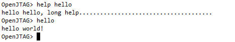

# uboot命令实现

在uboot中新增命令其实非常简单，只需要有2个过程：

1. 在`common`目录下，创建`cmd_xxx.c`文件，实现命令功能

2. 修改`common\Makefile`文件，添加`cmd_xxx.o`

## 在uboot中创建hello命令

1. 在`common`目录下新建`cmd_hello.c`文件，内容如下：

`cmd_hello.c`

```c
#include <common.h>
#include <command.h>

int do_hello(cmd_tbl_t *cmdtp, int flag, int argc, char *argv[])
{
    printf("hello world!\n");
    return 0;
}

U_BOOT_CMD(
	hello, CFG_MAXARGS, 1, do_hello,
	"hello - just for test\n",
	"hello, long help......................................"
);
```

2. 在`common\Makefile`文件末尾，添加`cmd_hello.o`

```mk
COBJS	= main.o ACEX1K.o altera.o bedbug.o circbuf.o \
	  cmd_ace.o cmd_autoscript.o \
	  cmd_bdinfo.o cmd_bedbug.o cmd_bmp.o cmd_boot.o cmd_bootm.o \
	  cmd_cache.o cmd_console.o \
	  cmd_date.o cmd_dcr.o cmd_diag.o cmd_display.o cmd_doc.o cmd_dtt.o \
	  cmd_eeprom.o cmd_elf.o cmd_ext2.o \
	  cmd_fat.o cmd_fdc.o cmd_fdos.o cmd_flash.o cmd_fpga.o \
	  cmd_i2c.o cmd_ide.o cmd_immap.o cmd_itest.o cmd_jffs2.o \
	  cmd_load.o cmd_log.o \
	  cmd_mem.o cmd_mii.o cmd_misc.o cmd_mmc.o \
	  cmd_nand.o cmd_net.o cmd_nvedit.o \
	  cmd_pci.o cmd_pcmcia.o cmd_portio.o \
	  cmd_reginfo.o cmd_reiser.o cmd_scsi.o cmd_spi.o cmd_universe.o \
	  cmd_usb.o cmd_usbslave.o cmd_menu.o cmd_vfd.o \
	  command.o console.o devices.o dlmalloc.o docecc.o \
	  environment.o env_common.o \
	  env_nand.o env_dataflash.o env_flash.o env_eeprom.o \
	  env_nvram.o env_nowhere.o \
	  exports.o \
	  flash.o fpga.o ft_build.o \
	  hush.o kgdb.o lcd.o lists.o lynxkdi.o \
	  memsize.o miiphybb.o miiphyutil.o \
	  s_record.o serial.o soft_i2c.o soft_spi.o spartan2.o spartan3.o \
	  usb.o usb_kbd.o usb_storage.o \
	  virtex2.o xilinx.o crc16.o xyzModem.o cmd_mac.o cmd_suspend.o cmd_hello.o
```

重新编译即可。

## 测试命令


