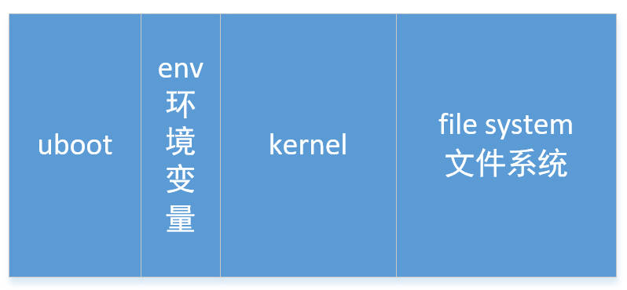
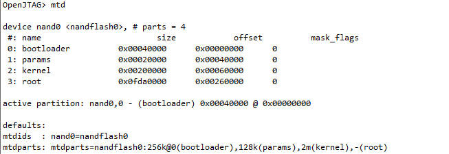

# uboot启动内核

## bootcmd如何读取启动内核？

之前讲过下面的代码，从环境变量中读取bootcmd的值，然后执行`run_command`

```c
s = getenv ("bootcmd");
printf("Booting Linux ...\n");            
run_command (s, 0);
```

这个过程具体做了些什么？

首先`bootcmd`命令的值是什么？可以看到，`bootcmd`命令值就是`nand read.jffs2 0x30007FC0 kernel; bootm 0x30007FC0`

这条命令什么意思？

+ 怎么读 : nand read.jffs2
+ 读到哪里 : 0x30007FC0
+ 从哪里读 : 从`kernel`读。`kernel`是什么？是一个分区
+ 怎么启动 : `bootm 0x30007FC0`

说白了就是，从nand的`nernel`分区读到`0x30007FC0`地址，然后从`0x30007FC0`地址启动

```c
#define CONFIG_BOOTCOMMAND	"nand read.jffs2 0x30007FC0 kernel; bootm 0x30007FC0"

#ifdef	CONFIG_BOOTCOMMAND
	"bootcmd="	CONFIG_BOOTCOMMAND		"\0"
#endif
```

实际上这是两条命令：

+ `nand read.jffs2 0x30007FC0 kernel`
+ `bootm 0x30007FC0`

## 读出内核

### 地址

这条命令`nand read.jffs2 0x30007FC0 kernel`用于读出内核。

+ 从哪里读？从`kernel`分区读
+ 读到哪里去？读到`0x30007FC0`地址处
  
由于NandFlash没有分区表，我们可以人为的将Flash分为这几个区域。



既然没有分区表，那这些分区又如何体现？答案是在源码中写死。

```c
#define MTDIDS_DEFAULT "nand0=nandflash0"

#define MTDPARTS_DEFAULT "mtdparts=nandflash0:256k@0(bootloader)," \
                            "128k(params)," \
                            "2m(kernel)," \
                            "-(root)"
```

所以说，实际上对于uboot分区，我们关心的不是分区的名字，而是分区的地址和大小。可以在uboot中使用`mtd`命令查看分区。可以看到，kernel分区的地址为0x0006 0000，大小为2M。

`nand read.jffs2 0x30007FC0 kernel`实际上等价于

`nand read.jffs2 0x30007FC0 0x00060000 0x00200000`



再次声明，分区名不重要，也只是代表某个地址和长度而已。

### 读取过程

通过`do_nand`函数来实现读取。这个函数做了些什么？

1. 判断操作动作

读取argv[1]，判断要执行的动作是读、写、擦除、打印等

```c
// nand read.jffs2 0x30007FC0 kernel

ulong addr, off, size;
char *cmd, *s;
nand_info_t *nand;

cmd = argv[1];   // cmd = read.jffs2

// 读写Nand
if (strncmp(cmd, "read", 4) == 0 || strncmp(cmd, "write", 5) == 0) {
    // argv[2] = 0x30007FC0，就是保存内核的地址，把字符串转为16进制数
    addr = (ulong)simple_strtoul(argv[2], NULL, 16);

    // XXX
}
```

2. 获取`kernel`分区的大小

```c
// argc - 3 = 1，argv + 3 = kernel 这一行就是从分区表中，获取kernel分区的偏移和大小
if (arg_off_size(argc - 3, argv + 3, nand, &off, &size) != 0)
    return 1;
```

3. 调用`Nand`通用接口，读取内核

```c
s = strchr(cmd, '.');
if (s != NULL &&
    (!strcmp(s, ".jffs2") || !strcmp(s, ".e") || !strcmp(s, ".i"))) {
    if (read) {
        /* read */
        nand_read_options_t opts;
        memset(&opts, 0, sizeof(opts));
        opts.buffer = (u_char*) addr;   // 要读到的位置
        opts.length = size;             // 内核大小
        opts.offset = off;              // 内核起始地址
        opts.quiet      = quiet;
        ret = nand_read_opts(nand, &opts);  // 读出内核
    } else {
        /* write */
        nand_write_options_t opts;
        memset(&opts, 0, sizeof(opts));
        opts.buffer = (u_char*) addr;
        opts.length = size;
        opts.offset = off;
        /* opts.forcejffs2 = 1; */
        opts.pad    = 1;
        opts.blockalign = 1;
        opts.quiet      = quiet;
        ret = nand_write_opts(nand, &opts);
    }
}
```

## 启动内核

`bootm 0x30007FC0`命令，用来启动内核。就是从Flash上面读，那么Flash保存的是什么？Flash存的内核称为`uImage`，就是头部 + 真正的内核。


### uImage格式

`uImage头部结构`

```c
#define IH_MAGIC	0x27051956	/* Image Magic Number		*/
#define IH_NMLEN		32	/* Image Name Length		*/

typedef struct image_header {
	uint32_t	ih_magic;	/* Image Header Magic Number	*/
	uint32_t	ih_hcrc;	/* Image Header CRC Checksum	*/
	uint32_t	ih_time;	/* Image Creation Timestamp	*/
	uint32_t	ih_size;	/* Image Data Size		*/
	uint32_t	ih_load;	/* Data	 Load  Address		*/
	uint32_t	ih_ep;		/* Entry Point Address		*/
	uint32_t	ih_dcrc;	/* Image Data CRC Checksum	*/
	uint8_t		ih_os;		/* Operating System		*/
	uint8_t		ih_arch;	/* CPU architecture		*/
	uint8_t		ih_type;	/* Image Type			*/
	uint8_t		ih_comp;	/* Compression Type		*/
	uint8_t		ih_name[IH_NMLEN];	/* Image Name		*/
} image_header_t;
```

下面对头部信息逐一解释：

+ ih_magic ： Magic Number固定为0x27051956，用于初步判断当前是不是Header
+ ih_hcrc  ： 头部所有内容的crc32校验和，也是用来判断当前是否为完整的Header
+ ih_time  ： Image创建时间
+ ih_size  ： Image大小
+ ih_load  ： 加载地址，表示内核运行时要放在哪里
+ ih_ep    ： 入口地址，要运行内核时直接跳到这个地址就可以了
+ ih_dcrc  ： Image的crc32校验和，用于判断当前内核是否完整没被破坏
+ ih_os    ： 操作系统
+ ih_arch  ： CPU架构
+ ih_type  ： Image类型
+ ih_comp  ： 压缩类型
+ ih_name  ： Image名称

想象一下，`bootm addr`做了些什么？

我们之前已经把uImage放在了addr处，bootm读出Header头部，知道了加载地址，知道了入口地址。如果发现当前内核地址`addr`并不位于加载地址，就把内核移动到加载地址，最后跳到入口地址去执行。

### do_bootm函数分析

`bootm 0x30007FC0`

1. 获取内核当前的地址

```c
ulong	addr;

// addr = 0x30007FC0
addr = simple_strtoul(argv[1], NULL, 16);
```

2. 仅移动Header，读出头部到全局变量`header`中

注意，此时就把头部64字节从

```c
image_header_t header;

image_header_t *hdr = &header;
memmove (&header, (char *)addr, sizeof(image_header_t));
```

3. 计算Magic Number和头部校验和

```c
if (ntohl(hdr->ih_magic) != IH_MAGIC) {
    {
    puts ("Bad Magic Number\n");
    SHOW_BOOT_PROGRESS (-1);
    return 1;
    }
}

data = (ulong)&header;
len  = sizeof(image_header_t);

checksum = ntohl(hdr->ih_hcrc);
hdr->ih_hcrc = 0;

if (crc32 (0, (uchar *)data, len) != checksum) {
    puts ("Bad Header Checksum\n");
    SHOW_BOOT_PROGRESS (-2);
    return 1;
}
SHOW_BOOT_PROGRESS (3);
```

4. 计算内核的数据部分校验和

```c
data = addr + sizeof(image_header_t);
len  = ntohl(hdr->ih_size);

if (verify) {
    puts ("   Verifying Checksum ... ");
    if (crc32 (0, (uchar *)data, len) != ntohl(hdr->ih_dcrc)) {
        printf ("Bad Data CRC\n");
        SHOW_BOOT_PROGRESS (-3);
        return 1;
    }
    puts ("OK\n");
}
SHOW_BOOT_PROGRESS (4);
```

5. 判断CPU架构是否支持

```c
#if defined(__PPC__)
	if (hdr->ih_arch != IH_CPU_PPC)
#elif defined(__ARM__)
	if (hdr->ih_arch != IH_CPU_ARM)
#elif defined(__I386__)
	if (hdr->ih_arch != IH_CPU_I386)
#elif defined(__mips__)
	if (hdr->ih_arch != IH_CPU_MIPS)
#elif defined(__nios__)
	if (hdr->ih_arch != IH_CPU_NIOS)
#elif defined(__M68K__)
	if (hdr->ih_arch != IH_CPU_M68K)
#elif defined(__microblaze__)
	if (hdr->ih_arch != IH_CPU_MICROBLAZE)
#elif defined(__nios2__)
	if (hdr->ih_arch != IH_CPU_NIOS2)
#elif defined(__blackfin__)
	if (hdr->ih_arch != IH_CPU_BLACKFIN)
#elif defined(__avr32__)
	if (hdr->ih_arch != IH_CPU_AVR32)
#else
# error Unknown CPU type
#endif
	{
		printf ("Unsupported Architecture 0x%x\n", hdr->ih_arch);
		SHOW_BOOT_PROGRESS (-4);
		return 1;
	}
	SHOW_BOOT_PROGRESS (5);
```

6. 判断Image类型是否支持
   
```c
switch (hdr->ih_type) {
case IH_TYPE_STANDALONE:
    name = "Standalone Application";
    /* A second argument overwrites the load address */
    if (argc > 2) {
        hdr->ih_load = htonl(simple_strtoul(argv[2], NULL, 16));
    }
    break;
case IH_TYPE_KERNEL:
    name = "Kernel Image";
    break;
case IH_TYPE_MULTI:
    name = "Multi-File Image";
    len  = ntohl(len_ptr[0]);
    /* OS kernel is always the first image */
    data += 8; /* kernel_len + terminator */
    for (i=1; len_ptr[i]; ++i)
        data += 4;
    break;
default: printf ("Wrong Image Type for %s command\n", cmdtp->name);
    SHOW_BOOT_PROGRESS (-5);
    return 1;
}
SHOW_BOOT_PROGRESS (6);
```

7. 关中断

为什么要关中断？因为接下来第8步要判断Image是否为压缩镜像。如果是则必须先解压缩，此过程不能被打断

```c
iflag = disable_interrupts();
```

8. 判断压缩类型

+ 如果内核当前存放地址不等于加载地址，则把内核移动到加载地址处
+ 如果Image是压缩类型，则先解压缩

```c
switch (hdr->ih_comp) {
case IH_COMP_NONE:
    if(ntohl(hdr->ih_load) == data) {
        printf ("   XIP %s ... ", name);
    } else {
        memmove ((void *) ntohl(hdr->ih_load), (uchar *)data, len);
    }
    break;
case IH_COMP_GZIP:
    printf ("   Uncompressing %s ... ", name);
    if (gunzip ((void *)ntohl(hdr->ih_load), unc_len,
            (uchar *)data, &len) != 0) {
        puts ("GUNZIP ERROR - must RESET board to recover\n");
        SHOW_BOOT_PROGRESS (-6);
        do_reset (cmdtp, flag, argc, argv);
    }
    break;
#ifdef CONFIG_BZIP2
case IH_COMP_BZIP2:
    printf ("   Uncompressing %s ... ", name);
    /*
        * If we've got less than 4 MB of malloc() space,
        * use slower decompression algorithm which requires
        * at most 2300 KB of memory.
        */
    i = BZ2_bzBuffToBuffDecompress ((char*)ntohl(hdr->ih_load),
                    &unc_len, (char *)data, len,
                    CFG_MALLOC_LEN < (4096 * 1024), 0);
    if (i != BZ_OK) {
        printf ("BUNZIP2 ERROR %d - must RESET board to recover\n", i);
        SHOW_BOOT_PROGRESS (-6);
        udelay(100000);
        do_reset (cmdtp, flag, argc, argv);
    }
    break;
#endif /* CONFIG_BZIP2 */
default:
    if (iflag)
        enable_interrupts();
    printf ("Unimplemented compression type %d\n", hdr->ih_comp);
    SHOW_BOOT_PROGRESS (-7);
    return 1;
}
puts ("OK\n");
SHOW_BOOT_PROGRESS (7);
```

9. 开中断

```c
if (iflag)
	enable_interrupts();
```

10. 根据操作系统类型，跳转到内核

调用`do_bootm_linux`函数跳转内核执行。

```c
switch (hdr->ih_os) {
default:			/* handled by (original) Linux case */
case IH_OS_LINUX:
    // 启动Linux内核
    do_bootm_linux  (cmdtp, flag, argc, argv,
                addr, len_ptr, verify);
    break;
case IH_OS_NETBSD:
    do_bootm_netbsd (cmdtp, flag, argc, argv,
                addr, len_ptr, verify);
    break;
}
```

### `0x30007FC0`地址

为什么是0x30007FC0这个地址？

因为`0x30007FC0 + 64(头部) = 0x3000 8000`。`0x3000 8000`这个地址，就是内存基地址`0x3000 3000`偏移`0x8000 (32KB)`。偏移的这`0x8000 (32KB)`用来做什么？用来保存页表！

我们设置`0x30007FC0`地址后，就不需要再次移动内核了，可以加快启动速度！

### do_bootm_linux函数分析

`现在内核已经位于加载地址上了，入口地址也知道了。否能直接跳转内核？还不够！`

回想一下，在PC电脑启动时，会去检测内存、Flash。比如PC机上的内存可能有1G、2G都没关系，都可以自动支持，因为有bios。bios会把内存检测出来告诉内核，显然Linux里面也有同样的东西。

`uboot要告诉内核一些参数！`

所以，`do_bootm_linux`函数要先设置启动参数，然后才是跳到入口地址处执行。

1. 获取内核的入口地址

```c
theKernel = (void (*)(int, int, uint))ntohl(hdr->ih_ep);
```

2. 设置启动参数

```c
#if defined (CONFIG_SETUP_MEMORY_TAGS) || \
    defined (CONFIG_CMDLINE_TAG) || \
    defined (CONFIG_INITRD_TAG) || \
    defined (CONFIG_SERIAL_TAG) || \
    defined (CONFIG_REVISION_TAG) || \
    defined (CONFIG_LCD) || \
    defined (CONFIG_VFD)
	setup_start_tag (bd);
#ifdef CONFIG_SERIAL_TAG
	setup_serial_tag (&params);
#endif
#ifdef CONFIG_REVISION_TAG
	setup_revision_tag (&params);
#endif
#ifdef CONFIG_SETUP_MEMORY_TAGS
	setup_memory_tags (bd);
#endif
#ifdef CONFIG_CMDLINE_TAG
	setup_commandline_tag (bd, commandline);
#endif
#ifdef CONFIG_INITRD_TAG
	if (initrd_start && initrd_end)
		setup_initrd_tag (bd, initrd_start, initrd_end);
#endif
#if defined (CONFIG_VFD) || defined (CONFIG_LCD)
	setup_videolfb_tag ((gd_t *) gd);
#endif
	setup_end_tag (bd);
#endif
```

3. 启动内核

先关中断，然后直接跳转到入口地址处去执行

```c
	/* we assume that the kernel is in place */
	printf ("\nStarting kernel ...\n\n");

    // 关中断
	cleanup_before_linux ();

	theKernel (0, bd->bi_arch_number, bd->bi_boot_params);
```
